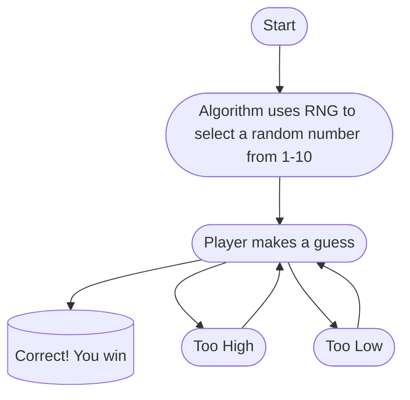

## Description of the Guessing Game (1–10)

In this random guessing game, the computer randomly selects a number between 1 and 10 (inclusive). The player is prompted to guess the number. After each guess, the game provides feedback:

- If the guess is **too high**, the game tells the player to guess a lower number.
- If the guess is **too low**, the game tells the player to guess a higher number.
- If the guess is **correct**, the game congratulates the player and ends.

The player can continue guessing until the correct number is found. Input validation ensures that guesses are numeric and within the allowed range of 1 to 10. If the input is invalid, the game prompts the player to enter a valid number.