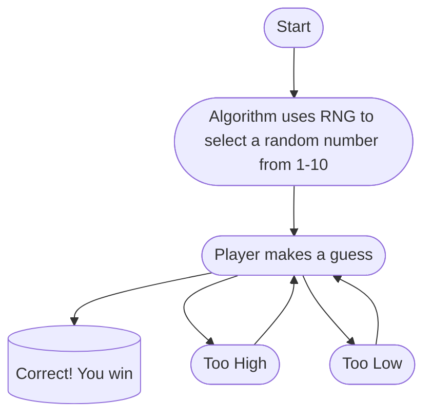

```mermaid
flowchart TD
Start([Start]) --> FirstStep([Algorithm uses RNG to select a random number from 1-10])
FirstStep --> Guess([Player makes a guess])
Guess --> Good[(Correct! You win)]
Guess --> Bad1([Too High]) --> Guess
Guess --> Bad2([Too Low]) --> Guess
```
